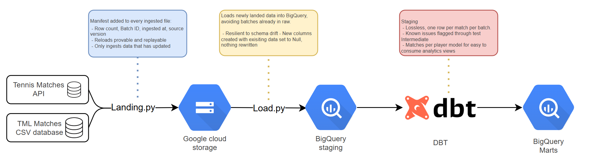

Buidling a bitemporal data warehouse using ATP tennis match data, with a view towards learning professional data engineering techniques and technologies (terraform/DBT/Airflow/GCS/BigQuery)

Architecture overview:

| Stage               | Tool         | What it does                                                        |
| ------------------- | ------------ | ------------------------------------------------------------------- |
| Extraction          | `landing.py` | Pulls files from source, writes each to GCS with a manifest         |
| Storage             | GCS          | Landing zone — per-file, immutable                                  |
| Loading             | `load.py`    | Loads new batches into BigQuery raw, reconciling schema drift       |
| Modelling & testing | dbt          | staging → intermediate → marts. Models available under /dbt_tennis/ |
| Orchestration       | Airflow      | *planned — not yet built*                                           |

Infrastructure is provisiong using Terraform

Why?
* The TML data has a full history with some retrospective fixes
* The API will provide info on changes in real time
* Reconciling both means learning and applying data engineering concepts

Step 1: Getting the TML data ingested into GCP, and building some data models off the back of the raw data.

Step 2L Loading the data into a GCP table (all stringss)

Step 3: Modelling that data with GCP to have sensible types

Decision log:

| Category  | |   | Decision made                                                                                                                                                 | |   | Justification                                                                                                                                                                                                                                                                                                                                                                                                                                                                                                                         |
| :-------- | :-- | :------------------------------------------------------------------------------------------------------------------------------------------------------------ | :-- | :------------------------------------------------------------------------------------------------------------------------------------------------------------------------------------------------------------------------------------------------------------------------------------------------------------------------------------------------------------------------------------------------------------------------------------------------------------------------------------------------------------------------------------ |
| Modelling | |   | matches_by__player is an intermediate table                                                                                                                   | |   | This table assembles the history in a way that is sensible for easily building analytics views, and doesn't involve any joining between sources. It must inherit any fixes that occur upstream when the API data is available for reconciliation.                                                                                                                                                                                                                                                                                     |
| Modelling | |   | Matches without a valid player_id are removed, even if the player_name column is available                                                                    | |   | If there isn't a player ID the row lacks referential integrity, therefore there's technically nothing to be able to count. The name could be used to reconcile what the ID should be, but that fix needs to be completed further upstream.                                                                                                                                                                                                                                                                                            |
| Modelling | |   | Matches without a match_num are to be excluded from int_matches__by_player                                                                                    | |   | This error surfaced as more historical data was added, but some rows are missing a match_num identifier, and therefore have a null match_sk and subsequently a null match_player_sk. This again violates the referencial integrity of the rows, and the table is matches by player, so both matches and player must be referable.                                                                                                                                                                                                     |
| Loading   | |   | When ingesting multiple batches, the full process of inserting the data will be followed per batch rather than attempting to update all the batches in one go | |   | Theoertically there is a pseudo colum _file_name in bigquery external tables, so theoretically I could stack staging up with all the data and bodge on the ingested and and batch_id from that, to then reduce the number of read/writes that occur. However this would make accounting for schema drift more complex, and for this dataset we would rarely expect there to be large volumes of batches with changes (most likely just the most recent year's csv) and so the added  complexity offers little benefit.                |
| Loading   | |   | The raw table will add new columns as new columns are noted in  the source data                                                                               | |   | Some of the older files caused errors as they don't have the "indoor" column, dynamically adding new columns involves a cheap "alter" statement that reports null for already existing rows and includes the data for the batch with the new column name. This solution means the script is resilient to schema drift, which we can't guarantee won't happen. The arrival of a new column should be warned in DBT and decisions can be made at that point how to best handle the incoming data/columns, without the pipeline failing. |

Defining new staging dataset in terraform main.tf rather than letting dbt make it
The project should stand on its own and terraform is basically the contract for provisioning resources. 
It's cleaner that all the instructions live there

int_matches__by_player - Does that go in staging or intermediate?
Theretically its more of an intermediate stage, I believe it satisfies a part of "assemeble history" even though it only uses one source.
Also I will want to resolve things between the tml data source and the API, and then I would need to propagate that through all the tables that use matches. Makes sense then for the shape change to occur further downstream

int_matches_by_player - player ID's null in 5 rows of the 2026 dataset
Without a player ID, they can't be identified and used for calculating playercentric metrics, and there also can't be a key per row
Therefore, it makes sense to exclude these rows entirely

Adapting the script now to work across all the singles files instead of just 2026, this means that for each file that is loaded into staging, the file is loaded to the staging table and then ingested and and batch ID are added on, that is loaded to the matches table, and then it loops through repeatedely adding data and appending the additional columns. It's not an elegant solution as we're doing multiple read and write transactions, and theoretically bigquery exposes a pseudo column _file_name on external tables which could be used to link back to the info in the manifest. But it would likely be overkill given the majority of changes will be just for the most recent year and occasionally for the historical years as corrections are made

Loading all the files shows that 1967 file is missing a column that the rest of the data does have, "Indoor". The Spec calls for schema changes to not make the whole thing fall over, so this is a good opportunity to build around this point on the spec. CUrrently the columns are defined explicitly, but instead we can read the columns in the "matches" table, and we can then compare with the columns in the staging table. If there's extras we can add a column and null everything else, and when inserting we can refer to the column names themselves. In DBT, the arrival of a new column out of nowhere should lead to a warning, but we can fix the output columns as part of the model itself.

Back into DBT: The int_matches_by_player model was hitting tonnes of warning after adding in the greater history as there's match_num that are null in the source; In stg_tml_matches we are now warning for null, and when we have the API source integrated we will look to have a resolving model that catches the incomplete data, for now its just necessary to be aware of as it affects downstream models.

int_matches_by_player was removing results with null player_id as that surfaced an issue initially, integrating the full history showed some matches without a match num, and therefore no match_sk could be generated for it. THe model is matches by player - both the match and the player therefore need referencial integrity, so I've changed the where clauses to mandate both pieces

int_matches_by_player: It appears there is a row in tml_matches with both the player id's the same, which then leads to a duplicate match_player_sk in int_matches__by_player. This should be flagged at source to have one central place for a sanity check. The int_matches__by_player model can filter then based on the flag